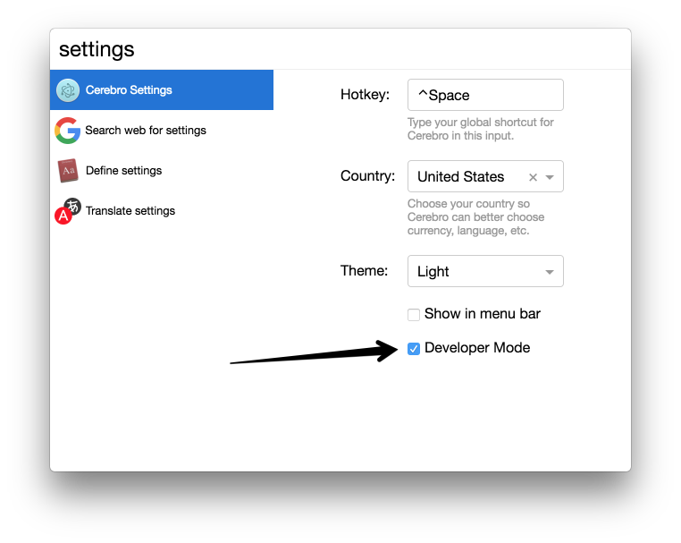

# Cerebro Plugin

> It is boilerplate to create plugins for [Cerebro app](http://www.cerebroapp.com)

## Usage
* Clone this repo to your machine;
* Edit `package.json` – `name`, `description`, `author` and `repository` fields;
* Run `npm install` – you are ready to build your plugin!

## Debugging your plugin
* Open [Cerebo app](http://www.cerebroapp.com);
* Enter `settings` and open preview for Cerebro Settings;
* Turn on developer mode;
* Now you have development submenu in tray menu. Choose reload and DevTools (main) to open developer tools.



Put your plugin directory to `~/Library/Application\ Support/Cerebro/plugins/`. Easiest way to do it is to use symbolic links with built-in command:
```
npm run debug
```


> On windows use [cygwin](https://www.cygwin.com/) or [git bash](https://git-scm.com/download/win) instead of cmd.exe and `./scripts/debug` command insttead of `npm run debug`

Or if you running Cerebro from source code:
```
npm run debug -- dev
```

## Documentation
Use Cerebro [documentation](https://github.com/KELiON/cerebro/blob/master/docs/plugins.md) for plugins.

## Related

* [Cerebro](http://github.com/KELiON/cerebro) – main repo for Cerebro app;
* [cerebro tools](http://github.com/KELiON/cerebro-tools) – package with tools to simplify package creation;

## License

MIT © [Alexandr Subbotin](http://asubbotin.ru)
